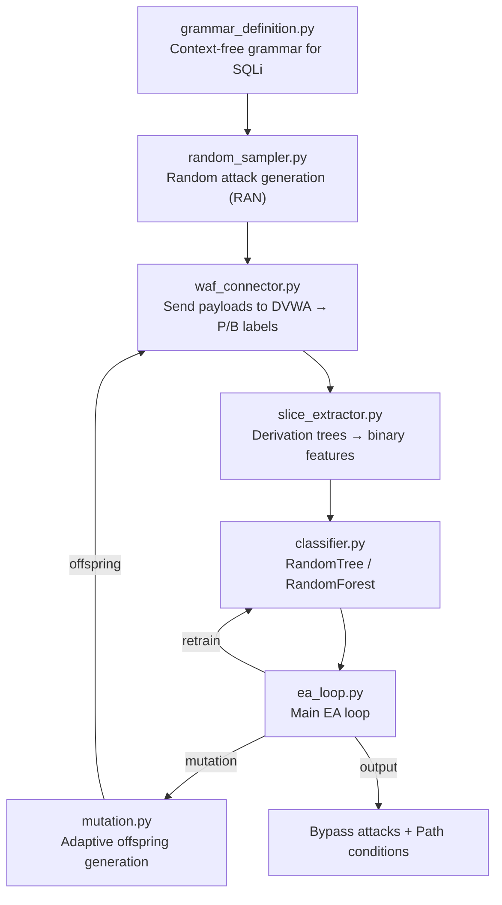

# ML-WAF: Evolutionary Algorithm for WAF Bypass

An ML-driven approach to testing Web Application Firewalls against SQL injection attacks. Based on the academic paper *"ML-Driven: An effective evolutionary algorithm to test Web Application Firewalls"*, this project uses a `(µ+λ)` evolutionary algorithm, a context-free grammar, and custom-built decision trees to automatically discover evasive attack payloads.

## Machine Learning Pipeline (`WAF_model/`)

The architecture relies entirely on pure-Python implementations (no external ML libraries like `scikit-learn`) to closely mirror the academic paper.

- **`ea_loop.py` (The Evolutionary Algorithm)**: The main `(µ+λ)` EA loop. It manages population ranking, elitist selection, archive updates, and classifier retraining across generations. It implements Variants B (Broad), D (Deep), and E (Enhanced adaptive).
- **`classifier.py` (Decision Trees)**: Implements **RandomTree** and **RandomForest** from scratch. It trains on binary feature matrices to output two things: the *bypass probability* (fitness score) and the *Path Conditions* (the specific lexical rules the AI deemed critical for evasion).
- **`mutation.py` (Adaptive Mutation)**: Distributes offspring budgets proportionally to a parent's bypass probability. It replaces subtrees in the parent payload while strictly preserving the required Path Conditions, preventing the mutant from losing its evasive properties.
- **`slice_extractor.py` (Feature Encoding)**: Converts raw SQLi derivation trees into "slices" (subtrees). It builds the binary feature matrix (where `1` means a slice is present, `0` is absent) used to train the classifiers.
- **`grammar_definition.py` (Search Space)**: Defines the SQLi attack vectors as a Context-Free Grammar (CFG), generating derivation trees that the EA mutates.
- **`random_sampler.py` (Baseline Generator)**: Uses a weighted random walk over the CFG to generate the initial mixed population. Also serves as the Random (RAN) baseline for benchmarking.
- **`waf_connector.py` (Fitness Evaluator)**: The oracle. Replays payloads against the target WAF to return ground-truth labels: `P` (Bypass/200 OK) or `B` (Blocked/403). Includes a `MockWafConnector` for local offline testing.
- **`benchmark.py`**: Evaluates the ML-Driven approach against the RAN baseline over a specific time budget, plotting the cumulative bypass success rate.

## Architecture Overview



## Dependencies

### Machine Learning Core (`WAF_model/`)
- `python >= 3.9`
- `matplotlib` (Only required for running `benchmark.py` to generate the comparison graphs)

Install Python dependencies:
```bash
pip install matplotlib
```

### WAF Target Environment (`ModSec_demo/`)
- **Docker** and **Docker Compose** are strictly required to run the vulnerable DVWA target and the ModSecurity Web Application Firewall.

## Setup Guide

The target WAF is a Dockerized instance of DVWA behind ModSecurity running the OWASP Core Rule Set.

### 1. Start the Target

```bash
cd ModSec_demo
docker compose up -d
```
The heavily protected target (ModSecurity + CRS) runs on `http://localhost:9003`.

### 2. Configure Session

1. Log in to `http://localhost:9003` (`admin` / `password`).
2. Go to **DVWA Security** and set it to **Low**.
3. Copy your `PHPSESSID` cookie from your browser's Developer Tools.

## Usage Commands

### Running the Evolutionary Algorithm

Run the main EA loop (Variant E is enabled by default):

```bash
cd WAF_model
python ea_loop.py <YOUR_PHPSESSID>
```

**Offline / Sandbox Testing:**
If you want to test the ML loop locally without Docker, use the `mock` argument to run against a naive keyword blacklist:
```bash
python ea_loop.py mock E forest
```

### Benchmarking against Random Gen

Compare the ML-Driven EA against a purely Random (RAN) generation baseline over a 15-minute budget:

```bash
python benchmark.py --phpsessid <YOUR_PHPSESSID> --time 15 --output results.png
```
